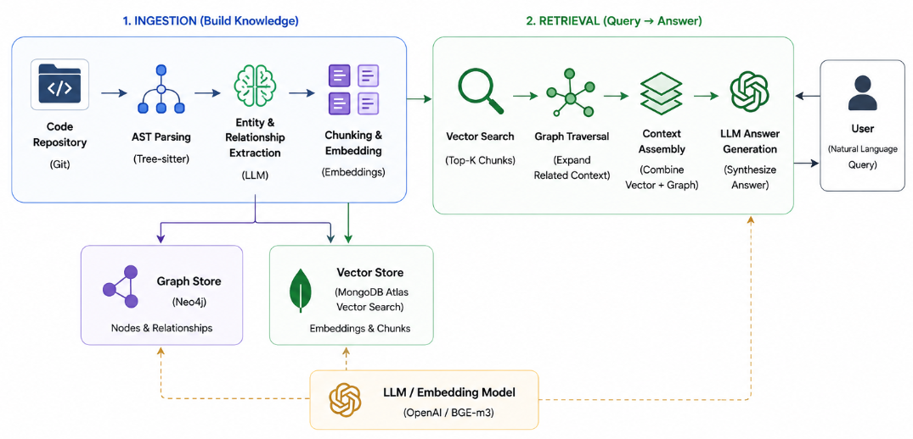

# 🧠 Engineering Intelligence Hub

Multimodal GraphRAG for Codebase Comprehension

## Problem

⚠️ Code sunk-cost and "blast radius" anxiety are major blockers for engineering velocity in large codebases. Simple semantic search (Ctrl+F) or traditional RAG implementations treat code as flat text and destroy structural hierarchy and developers also have to deal with LLM hallucinations when they want to understand a codebase thouroughly. Example: when a developer asks "What happens if I update the authentication middleware?", standard tools cannot accurately predict the blast radius of dependencies.

## Solution

💡 The Engineering Intelligence Hub builds AST-aware knowledge graphs to understand code like a senior engineer, by meaning and structural relationships.

Instead of naive text chunking, the system uses Abstract Syntax Tree (AST) parsing to split code into logical blocks (functions, classes), extracts entities and relationships with an LLM, and stores:

- Graph Storage: relationships and nodes in Neo4j
- Vector Storage: semantic chunks embedded and stored in MongoDB Atlas Vector Search

This hybrid approach enables structurally aware retrieval and accurate answers to architectural queries.

## System Architecture & Workflow

The architecture is divided into two main components: the ingestion pipeline and the hybrid retrieval engine.

### Ingestion Pipeline (Data → Graph)

- **AST Parsing:** Tree-sitter traverses the repository to semantically extract functions, classes, and docstrings without breaking code logic.
- **Entity & Relationship Extraction:** An LLM processes code chunks to identify relational edges (e.g., `ClassA` → INHERITS → `ClassB`, `functionX()` → CALLS → `functionY()`).
- **Dual Storage:**
	- Graph storage in Neo4j for relationships and nodes
	- Vector storage in MongoDB Atlas Vector Search for semantic chunks

### Hybrid Retrieval Engine (Query → Answer)

- **Intent Parsing:** Users submit natural language queries (e.g., "How does the checkout route connect to the database?").
- **Vector Search:** The query is embedded and MongoDB Atlas returns the top-K semantically relevant chunks.
- **Graph Traversal:** Entities from vector hits are expanded via Cypher queries in Neo4j to retrieve neighbors (parents, children, dependencies).
- **LLM Synthesis:** Vector and graph context are combined and fed to an LLM to generate accurate, citation-backed responses.

## Tech Stack

- **Frontend:** React.js
- **Backend API:** Node.js / Express.js
- **ML & Parsing Pipeline:** Python
- **AST Parser:** Tree-sitter
- **Graph Database:** Neo4j
- **Vector Database:** MongoDB Atlas Vector Search
- **Embeddings & LLM:** BGE-m3 / OpenAI

## Evaluation Metrics (In Progress)

To ensure production-grade accuracy, the retrieval engine is evaluated using:

- **Mean Reciprocal Rank (MRR):** Measures rank of the correct target file in retrieval results.
- **Context Precision:** Ensures retrieved graph neighbors are relevant to the user query.
